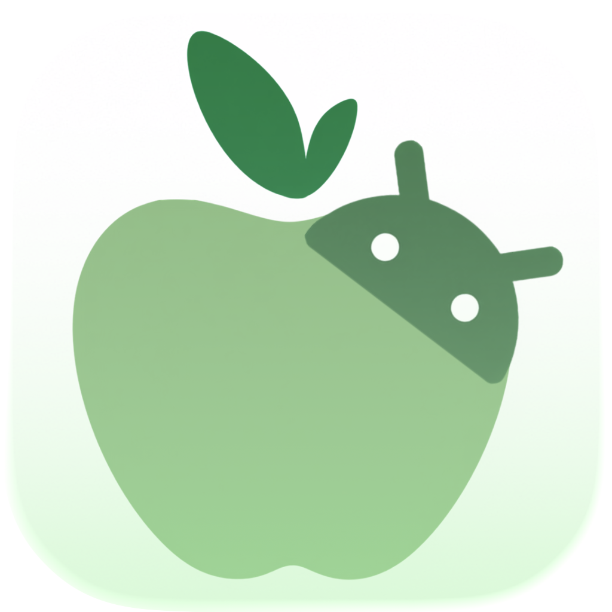

# AppleDroid

**Il file manager per Mac che parla nativamente con Android.**

Naviga, trasferisci e gestisci i file del tuo telefono direttamente dal Mac — via cavo o Wi-Fi, senza installare nulla sul telefono.

[Scarica l'ultima versione](../../releases/latest) · [Segnala un problema](mailto:rocketcode.exe@gmail.com) · [Sostieni il progetto](https://paypal.me/razzano13)

---

## Perché AppleDroid

Le soluzioni esistenti per collegare Android a macOS sono spesso lente, poco curate o smettono di funzionare da un aggiornamento all'altro. AppleDroid nasce per essere l'esatto opposto: un'app piccola, veloce, con un'interfaccia che si sente a casa su macOS — perché è stata disegnata per macOS, non adattata da un altro sistema.

Non installa nessuna app sul telefono: usa il **debug USB** o il **debug wireless** già integrati in Android, esattamente lo stesso meccanismo che usano gli sviluppatori Android per collegare i propri dispositivi.

## Funzionalità

- **Trasferimenti in entrambe le direzioni** — trascina file dal Finder al telefono e viceversa, cartelle intere incluse, con una barra di avanzamento reale basata sul progresso effettivo del trasferimento.
- **USB o senza cavo** — collega il telefono via cavo o via Wi-Fi sulla stessa rete, e passa dall'uno all'altro quando vuoi. Più dispositivi collegati contemporaneamente sono supportati.
- **Gestione completa dei file** — crea cartelle, rinomina, elimina, cerca e ordina, con le stesse scorciatoie da tastiera che usi già su macOS (frecce, Cmd+A, Canc, Spazio per l'anteprima).
- **Anteprima rapida** — premi Spazio su un file per vederlo con Quick Look, senza doverlo prima scaricare manualmente.
- **Spazio di archiviazione a colpo d'occhio** — visualizza quanto spazio è occupato sul telefono e come si suddivide tra foto, video, audio e documenti.
- **Aggiornamenti automatici** — l'app controlla da sola se è disponibile una nuova versione su GitHub e te lo segnala in-app.

## Requisiti

| Requisito | Dettaglio |
|---|---|
| Sistema operativo | macOS 14 (Sonoma) o successivo |
| Telefono | Android con debug USB o debug wireless attivabile (Android 8.0+) |
| Connessione | Cavo USB, oppure stessa rete Wi-Fi tra Mac e telefono |

> Se distribuisci l'app per un target macOS diverso, verifica in Xcode → target → *Deployment Info* qual è la versione minima effettiva impostata nel progetto, e aggiorna questa tabella di conseguenza.

## Installazione

1. Scarica l'ultima release dalla sezione [Releases](../../releases/latest) di questa repository.
2. Estrai lo `.zip` (o apri il `.dmg`) e trascina **AppleDroid** nella cartella Applicazioni.
3. Alla prima apertura macOS potrebbe avvisarti che l'app proviene da uno sviluppatore non identificato — è normale per le app distribuite fuori dal Mac App Store. Fai clic destro sull'app → **Apri** → conferma una volta. Le aperture successive saranno immediate.

## Primo collegamento del telefono

### Via cavo USB

1. Sul telefono vai su **Impostazioni → Info telefono**.
2. Tocca 7 volte su **Numero build** per attivare la modalità sviluppatore.
3. Torna indietro, vai su **Opzioni sviluppatore** e attiva **Debug USB**.
4. Collega il cavo USB al Mac.
5. Sul telefono comparirà un popup: tocca **Consenti** per autorizzare questo Mac.
6. In AppleDroid, premi **Cerca Dispositivi**.

### Senza cavo, via Wi-Fi

1. Il telefono e il Mac devono essere sulla stessa rete Wi-Fi.
2. Sul telefono vai su **Impostazioni → Opzioni sviluppatore** e attiva **Debug wireless**.
3. Tocca **Debug wireless** per aprirne i dettagli: vedrai un indirizzo IP e una porta (es. `192.168.1.42:37421`).
4. In AppleDroid, tocca l'icona Wi-Fi in alto e inserisci IP e porta separatamente.
5. Tocca **Connetti**.

> La porta del debug wireless cambia ogni volta che lo riattivi. Se la connessione smette di funzionare, torna nelle impostazioni del telefono e leggi la nuova porta.

## Supporto e contributi

Se trovi un problema o hai un suggerimento, apri una [issue](../../issues) o scrivi a **rocketcode.exe@gmail.com**. Se AppleDroid ti è utile, una donazione libera via [PayPal](https://paypal.me/razzano13) aiuta a mantenerlo aggiornato.

## Licenza e termini d'uso

© 2026 Antonio Razzano. Tutti i diritti riservati.

Il file compilato di AppleDroid è distribuito gratuitamente per uso personale. Il codice sorgente **non** è open source: non è consentito modificare, decompilare, decodificare, ridistribuire, rivendere o creare opere derivate dell'applicazione, in tutto o in parte, senza autorizzazione scritta dell'autore.

---

Sviluppato da Antonio Razzano

